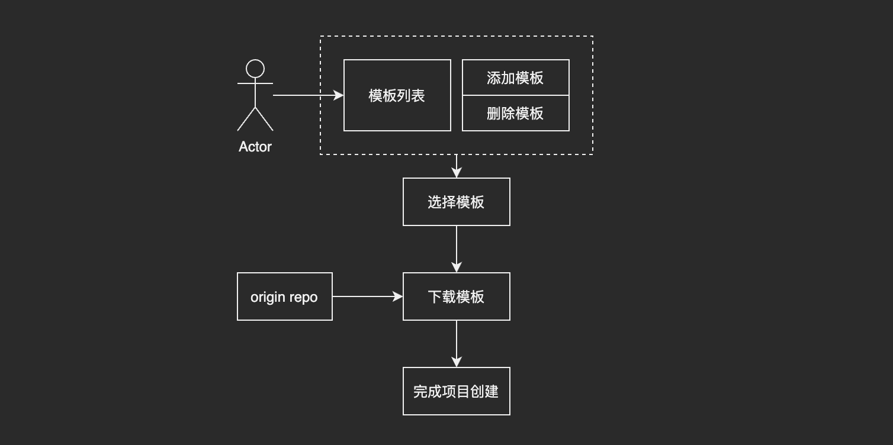

# portable-cli

一个简易的脚手架，目前已经配置两个模板
- `blog`：一个使用 issue 来写 blog 的模板，预览 [issues blog](https://niexia.github.io/#/)
- `admin`：一个 Vue + element ui 的后台管理系统，预览 [admin-system](https://niexia.github.io/vue-element-admin/)

## 使用

1. 安装

```shell
npm install -g portable-cli
```

2. 查看模板

```shell
portable-cli list

➡️  Template name: blog, Github address https://github.com/niexia/issues-blog-template.git
➡️  Template name: admin, Github address https://github.com/niexia/vue-element-admin.git
```

3. 使用模板创建项目


```shell
# portable-cli create <template-name> <project-name>

portable-cli create blog my-blog

PORTABLE CLI v1.0.2
📦 Creating project in /Users/yangjin/Documents/enrich-github/my-blog.

⠋  Download project template. This might take a while...

🗃  Initializing git repository...

🎉  Successfully created project my-blog.
```

4. 添加模板

```shell
# portable-cli add <template-name> <git-repo-address>

portable-cli add my-blog-template https://github.com/niexia/issues-blog-template.git

🎉  Successfully add project template my-blog-template.

# list template

portable-cli list

➡️  Template name: blog, Github address https://github.com/niexia/issues-blog-template.git

➡️  Template name: admin, Github address https://github.com/niexia/vue-element-admin.git

➡️  Template name: my-blog-template, Github address https://github.com/niexia/issues-blog-template.git
```

5. 删除模板

```shell
# portable-cli delete <template-name>

portable-cli delete my-blog-template 

? Make sure that you want to delete the template my-blog-template? Yes

🎉  Successfully delete project template my-blog-template.
```

## 为什么需要脚手架

随着项目逐渐复杂和增加之后

1. 每个项目都需要设置一样的配置，复制粘贴
2. 多个项目的配置和结构容易出现不统一，不好管理

通过使用脚手架，配置一系列的指令，同时定义好不同选择对应的模板，就可以根据实际情况的选择，直接生成一套合适的项目代码，解决上面的问题。

## 设计

在脚手架内部提供一些能力，和用户进行交互

1. 根据不同场景定义好对应的模板，统一项目结构，相关的代码设计
2. 脚手架通过命令式和用户进行交互，选择对应的模板进行初始化项目
3. 脚手架和模板解耦，支持对模板进行管理



## License

[MIT](./LICENSE)
